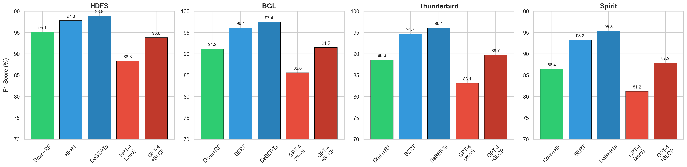
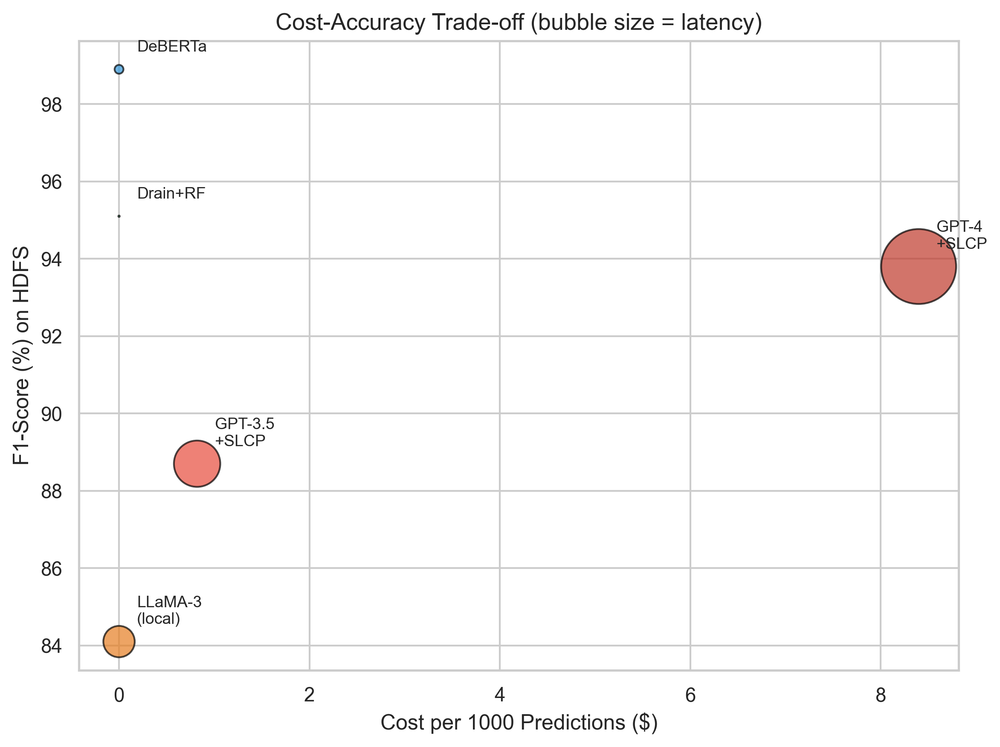
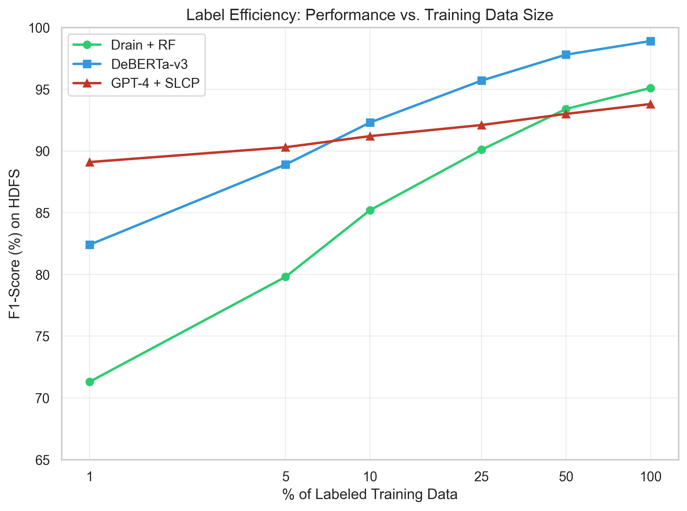

# LLM-Enhanced Log Anomaly Detection Benchmark

A comprehensive benchmark comparing Large Language Models (LLMs), fine-tuned transformers, and traditional methods for automated system anomaly detection across large-scale real-world datasets.

---

## Why This Matters

Detecting failures in large-scale systems remains challenging due to evolving log patterns and limited labeled data. Traditional methods require extensive log parsing and labeled training data, while LLMs offer a promising alternative with zero-shot capabilities.

This project systematically evaluates when to use each approach — giving practitioners actionable guidelines based on their specific constraints around accuracy, cost, latency, and label availability.

---

## Overview

---

## Key Findings

- **Fine-tuned DeBERTa-v3** achieves the highest accuracy (F1: 95.3–98.9%)

- **GPT-4 zero-shot** shows strong performance (F1: 81.2–88.3%) without any training data

- Our **Structured Log Context Prompting (SLCP)** improves LLM zero-shot performance by 2.9–3.1%

- Traditional **Drain + Random Forest** remains competitive (F1: 86.4–95.1%) with minimal latency

---

## Datasets

All datasets are publicly available from [LogHub](https://github.com/logpai/loghub):

- **HDFS** — Hadoop Distributed File System (11M+ log messages)

- **BGL** — Blue Gene/L supercomputer (4.7M+ messages)

- **Thunderbird** — Sandia National Labs (211M+ messages)

- **Spirit** — Spirit supercomputer (272M+ messages)

---

## Methods Evaluated

| Category | Methods |
|----------|---------|
| Traditional | Drain + {LR, RF, SVM, IF} |
| Fine-tuned Transformers | BERT, RoBERTa, DeBERTa-v3 |
| Prompt-based LLMs | GPT-3.5, GPT-4, LLaMA-3 (zero/few-shot + SLCP) |

---

## Results

| Method | HDFS | BGL | Thunderbird | Spirit |
|--------|------|-----|-------------|--------|
| Drain + RF | 95.1 | 91.2 | 88.6 | 86.4 |
| DeBERTa-v3 | **98.9** | **97.4** | **96.1** | **95.3** |
| GPT-4 + SLCP (5-shot) | 93.8 | 91.5 | 89.7 | 87.9 |

### Cost-Accuracy Trade-off

### Label Efficiency

---

## Quick Start

    # Clone
    git clone https://github.com/disha8611/llm-log-anomaly-benchmark.git
    cd llm-log-anomaly-benchmark

    # Install dependencies
    pip install -r requirements.txt

    # Run traditional ML experiments
    python src/run_experiments.py

    # Run transformer fine-tuning
    python src/run_transformers.py

    # Generate figures
    python src/benchmark.py --generate-figures

---

## Project Structure

    src/
      benchmark.py          # Main experiment code
      run_experiments.py    # Traditional ML experiments
      run_transformers.py   # Transformer fine-tuning
    paper/
      main.tex              # Full paper (LaTeX)
    figures/                # Generated figures (PDF/PNG)
    results/                # Experiment results (JSON)
    requirements.txt        # Python dependencies
    LICENSE                 # MIT License

---

## Links

- **Paper:** [arXiv:2604.12218](https://arxiv.org/abs/2604.12218)
- **Blog:** [Medium article](https://medium.com/p/27a46425e350)
- **Plain language summary:** [Gist.Science](https://gist.science/paper/2604.12218)

---

## Citation

If you use this benchmark in your research, please cite:

    @article{patel2026llm,
      title={LLM-Enhanced Log Anomaly Detection: A Comprehensive Benchmark of Large Language Models for Automated System Diagnostics},
      author={Patel, Disha},
      journal={arXiv preprint arXiv:2604.12218},
      year={2026}
    }

---

## License

MIT License — see [LICENSE](LICENSE) for details.
